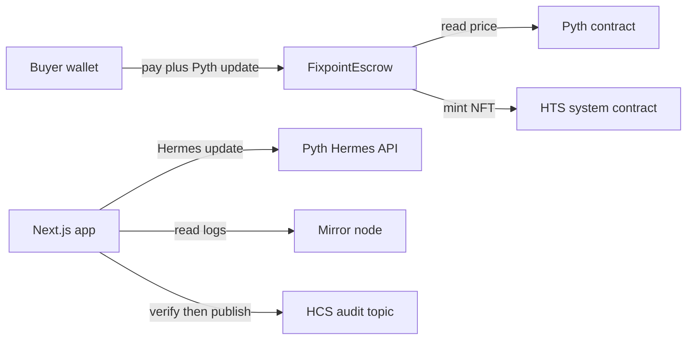

<div align="center">


# Fixpoint

**Price in dollars. Settle in HBAR. Prove it on HCS.**

[](LICENSE)
[](https://hashscan.io/testnet)
[](https://nodejs.org)
[](packages/hardhat/test/FixpointEscrow.test.ts)

USD priced escrow on Hedera. Sellers invoice in dollars. Buyers pay HBAR at a live Pyth rate. The contract holds the funds, mints an HTS receipt, and every step lands on an HCS audit trail.

</div>

## Start here, 60 seconds

You need Node 20.18.3 or newer and npm 10 or newer. Nothing else.

```bash
npm create scaffold-hbar@latest -- --template trinnode/fixPoint
cd fixpoint
npm install
cp .env.example packages/nextjs/.env
npm run db:push
npm run db:seed
npm run dev
```

Open `http://localhost:3000`. Create an invoice, pay it as the buyer, release it, watch the audit write itself on `/history`. No wallet needed. No keys needed. Details below.

> Note the `--` before `--template`. npm needs it to pass the flag through. Without it you get the default template.

## Live on testnet right now

This template is deployed, not mocked. Verify everything in a browser (Hashscan blocks script clients, the mirror node links return the same facts as JSON).

| Object | Address | Links |
| --- | --- | --- |
| Escrow contract | `0xD41da4456C08423ab652D011f20f26F19Fd003a5` (`0.0.10856608`) | [Hashscan](https://hashscan.io/testnet/contract/0.0.10856608) · [Mirror node](https://testnet.mirrornode.hedera.com/api/v1/contracts/0xD41da4456C08423ab652D011f20f26F19Fd003a5) |
| Invoice id 2, created on chain | USD 5.00, state CREATED | [Hashscan tx](https://hashscan.io/testnet/transaction/0.0.7314364@1791115079.401144125) |
| HCS audit topic | `0.0.10856645` | [Hashscan](https://hashscan.io/testnet/topic/0.0.10856645) · [Messages](https://testnet.mirrornode.hedera.com/api/v1/topics/0.0.10856645/messages?limit=5&order=desc) |
| Pyth receiver | `0xA2aa501b19aff244D90cc15a4Cf739D2725B5729` | [Pyth docs](https://docs.pyth.network/price-feeds/contract-addresses/evm) |

Full table, procedure, and open items: [`docs/testnet-evidence.md`](docs/testnet-evidence.md).

## Two ways to run it

| | Demo ledger | Wallet mode |
| --- | --- | --- |
| Needs | Nothing | HashPack + `NEXT_PUBLIC_WC_PROJECT_ID` |
| Funds move | Simulated locally | Real HBAR on testnet |
| Good for | Learning the flow in a minute | Real settlement, real receipts |
| How | Role switcher in the header | Connect button in the header |

Demo mode is the default. Every number there is labelled as simulated. Wallet mode reads the live contract through the relay and sends through your wallet. If a step cannot run on chain yet, the UI says why instead of failing silently.

## What it does

| Capability | How |
| --- | --- |
| 💵 Dollar invoices | Seller sets USD cents, a pay by date, a review window |
| 🔮 Live Pyth rate | `pay` reads HBAR USD on chain, rejects prices older than 60 s or wider than 100 bps, rounds up for the seller |
| 🧾 HTS receipt | Contract mints an NFT receipt to the buyer wallet on payment |
| 🔒 Real escrow | Funds move only to seller (release, claim after review) or buyer (refund, expired claim). No owner, no withdraw |
| 📜 HCS audit | Every state change is verified on the mirror node, then published idempotently by tx hash |
| 👛 Wallet first | HashPack pairing, live reads, on chain create, associate, settle |
| 🎨 Premium UI | Light first design, 3D hero, guided steps, full dark mode |

## Architecture



The chain is the source of truth. The relayer only audits what the mirror node confirms. HCS is the tamper evident log, never the database. The local SQLite ledger mirrors these facts so the demo runs offline. Full version: [`docs/architecture.md`](docs/architecture.md). Threats and limits: [`docs/threat-model.md`](docs/threat-model.md), [`SECURITY.md`](SECURITY.md).

## Project layout

```
fixpoint/
├── template.json                  scaffold manifest for npm create
├── packages/hardhat/              FixpointEscrow.sol, deploy + demo scripts, 43 tests
│   └── deployed/                  live addresses, no secrets ever
└── packages/nextjs/               app, API routes, wallet integration, demo ledger
    └── prisma/                    local SQLite schema, demo only
```

Agent instructions: [`AGENTS.md`](AGENTS.md). Contract ops: [`packages/hardhat/README.md`](packages/hardhat/README.md).

## Commands

All from the repo root with npm.

| Command | What it does |
| --- | --- |
| `npm install` | Install all workspaces, generate the Prisma client |
| `npm run dev` | Start the app on `:3000` |
| `npm run build` | Production build, passes with an empty environment |
| `npm run lint` | ESLint frontend plus contract typecheck |
| `npm run check-types` | Strict TypeScript on the frontend |
| `npm test` | 43 Hardhat tests on mocks |
| `npm run hardhat:compile` | Compile the contracts |
| `npm run hardhat:deploy` | Deploy to testnet, needs a funded ECDSA key |
| `npm run demo` | Full flow on testnet, prints Hashscan links |
| `npm run db:push` | Create demo tables |
| `npm run db:seed` | Seed four demo invoices |

CI runs install, compile, test, lint, types, and build on Node 20 and 22, plus a boot smoke test that curls every core route.

## Deploy to Vercel

The repo ships a `vercel.json` that builds the monorepo as is. Import `trinnode/fixPoint` in Vercel and deploy. No Root Directory change needed. Set the environment variables in the project settings **before** the first deploy, because `NEXT_PUBLIC_` values are baked in at build time.

| Name | Value |
| --- | --- |
| `DATABASE_URL` | The pooled Postgres URL from Vercel Storage (see data setup below) |
| `NEXT_PUBLIC_CONTRACT_ADDRESS` | `0xD41da4456C08423ab652D011f20f26F19Fd003a5` |
| `NEXT_PUBLIC_HCS_TOPIC_ID` | `0.0.10856645` |
| `NEXT_PUBLIC_WC_PROJECT_ID` | Your Reown project id for HashPack pairing |
| `PYTH_HERMES_KEY` | Your Pyth key for live prices, otherwise the app shows the labelled seed |

### Data setup for production

SQLite cannot run on serverless, the filesystem is ephemeral. Use Postgres for the live site.

1. In Vercel go to Storage, create a Postgres database, and connect it to the project. Copy both the pooled URL and the direct (non pooling) URL.
2. On your machine, point at the direct URL and create the tables plus the seed data. From the repo root:

   ```
   DATABASE_URL="<direct url>" npm run db:push
   DATABASE_URL="<direct url>" npm run db:seed
   ```

   The seed is idempotent, so running it twice is safe. If your schema still says `sqlite`, change the provider line in `packages/nextjs/prisma/schema.prisma` to `postgresql` first. Keep `sqlite` for local work.
3. In the Vercel project settings set `DATABASE_URL` to the pooled URL and redeploy. Open `/history` on the live URL. The four seeded invoices should be there with agreement markers.

Wallet mode works on the live URL as soon as the contract address and topic id are set. Demo mode works too, reading the Postgres ledger instead of a local file.

## Environment

Copy `.env.example` to `packages/nextjs/.env` for the app and `packages/hardhat/.env` for chain scripts. Every value ships empty and the build passes that way.

| Name | Needed for | Example |
| --- | --- | --- |
| `DATABASE_URL` | Demo ledger | `file:./dev.db` |
| `NEXT_PUBLIC_WC_PROJECT_ID` | Wallet pairing | Reown project id |
| `NEXT_PUBLIC_CONTRACT_ADDRESS` | Wallet reads and writes | `0xD41d...` (defaults to the live deployment) |
| `NEXT_PUBLIC_RECEIPT_TOKEN_ID` | Pay with mint | `0.0.x` when the collection exists |
| `NEXT_PUBLIC_HCS_TOPIC_ID` | Audit reference | `0.0.10856645` |
| `PYTH_HERMES_KEY` | Live price updates | `pyth-...` |
| `HEDERA_OPERATOR_ID` / `HEDERA_OPERATOR_KEY` | Deploy only, ECDSA, never commit | `0.0.1234` |
| `PRICE_FEED_ID` | Deploy only | HBAR USD feed id from Hermes |
| `HCS_TOPIC_ID`, `RECEIPT_TOKEN_ID`, `MIRROR_NODE_URL` | Overrides | See `.env.example` |

Without `PYTH_HERMES_KEY` the app shows a labelled seed price, honest and never disguised. Without a Hermes key, live pay surfaces the exact revert reason.

## Testing

```
npm run hardhat:compile
npm test
npm run check-types
npm run lint
npm run build
```

Contract tests cover the happy path, exact pricing vectors with rounding dust, stale and wide confidence rejections, over and underpayment, every access rule, every illegal transition, HTS failures, and reentrancy on pay, release, and refund.

## Extending

Swap the feed by changing the Hermes query and redeploying with the new feed id. Add settle paths with a contract function, an event, and a route, keeping the one transition one event rule. The UI can be reshaped freely as long as every route renders with an empty environment and the typed API in `lib/api.ts` is respected. Never round down. Never relax the bounds without writing down why.

## Troubleshooting

| Symptom | Fix |
| --- | --- |
| `RECEIPT_NOT_ASSOCIATED` on pay | Press Associate first, buyers must hold the token |
| Pay reverts as stale | Hermes key missing or keeper quiet, retry on a fresh quote |
| Wallet will not pair | Set `NEXT_PUBLIC_WC_PROJECT_ID`, confirm HashPack is on testnet |
| Mirror data lags | Wait a few seconds, history polls with backoff |
| `DATABASE_URL` missing | Copy the example env, set `file:./dev.db`, run `db:push` |

## License and credits

MIT, see [`LICENSE`](LICENSE). Built on Hedera EVM, HTS, and HCS, the Pyth oracle, Next.js, Hardhat, and OpenZeppelin contracts. Starting point, not audited. Audit before mainnet value.
