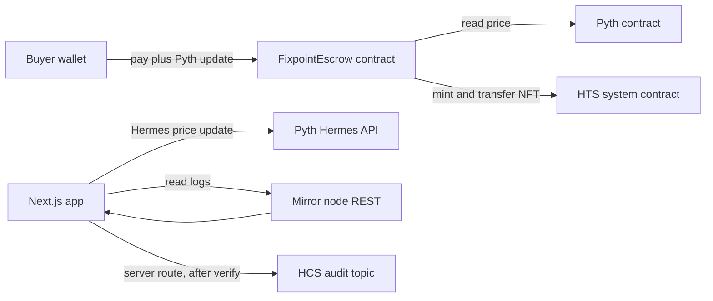

# Fixpoint


USD priced escrow, three Hedera services composed, Pyth oracle, tested, documented, one command.

Fixpoint is a template for escrow payments on Hedera where the price is set in dollars and the settlement happens in HBAR. A seller creates an invoice for a USD amount. A buyer pays it in HBAR at the live HBAR USD rate published by the Pyth oracle. The escrow contract holds the HBAR, mints an HTS NFT receipt to the buyer, and every state change is written to an HCS audit topic that a mirror node powered history view reads back. The dollar amount never moves. Only HBAR moves, and only at the oracle rate, with safety bounds that reject stale or loose prices.

Scaffold it with one command:

```
npm create scaffold-hbar@latest -- --template trinnode/fixPoint
```

Note the `--` before `--template`. npm needs it to pass the flag through to the CLI. Without it, npm consumes the flag and you get the default template.

## Run it in 5 minutes

You need Node 20.18.3 or newer and npm 10 or newer. No other toolchain. The build passes with an empty environment. Secrets are read lazily at runtime only.

1. Get the code, either through the scaffold command above or by cloning this repo.

2. Install dependencies from the repo root.

   ```
   npm install
   ```

3. Set up the local demo ledger. The Next.js app reads its environment from `packages/nextjs/.env`, and the Hardhat scripts read theirs from `packages/hardhat/.env`. Copy the example file to both places, then set the database URL in the frontend env to a local SQLite file.

   ```
   cp .env.example packages/nextjs/.env
   cp .env.example packages/hardhat/.env
   ```

   In `packages/nextjs/.env`, set `DATABASE_URL` to `file:./dev.db`. Then create the tables. The root script delegates to the frontend package.

   ```
   npm run db:push
   ```

4. Seed the demo ledger. The seed is idempotent. It creates four invoices that together exercise every state, plus their audit messages.

   ```
   npm run db:seed
   ```

5. Start the app.

   ```
   npm run dev
   ```

Open `http://localhost:3000`. The home page shows the live price card with its source label, the four step flow, and the honesty note. Create an invoice as the seller on `/invoices/new`. Switch to the buyer role in the header, associate the receipt token, pay at the live quote, then switch back and release. Open `/history` to see chain events beside their HCS audit messages, with agreement markers where the two match.

## Reproduce the testnet transaction

The template ships a deploy script and a demo flow script in `packages/hardhat/scripts`. Fund an ECDSA testnet account from the Hedera Portal faucet first, then export it. Never commit these values.

```
export HEDERA_OPERATOR_ID=0.0.xxxxxx
export HEDERA_OPERATOR_KEY=0x...
export PRICE_FEED_ID=<HBAR USD feed id from Hermes>
npm run hardhat:deploy
npm run demo -- --network hederaTestnet
```

The demo script runs create, pay and release end to end on testnet and prints Hashscan links for the contract, the three transactions, the NFT token and the HCS topic messages. Copy those links into `docs/testnet-evidence.md`, which holds the exact table the submission needs. Until you run it, that file documents the procedure and the link shapes so a judge can verify each one in seconds.

## Architecture



The deployed template has no database. The chain is the source of truth. A relayer route reads the chain event from the mirror node, verifies it belongs to this contract, then publishes a signed, compact, versioned audit message to the HCS topic. The app reads state from the contract and the mirror node and uses HCS as the tamper evident history.

HCS cannot be written from a smart contract. That is why the relayer exists. The relayer only audits. It never holds funds. It verifies the chain event first, then publishes. The local SQLite ledger in `packages/nextjs/prisma` exists only so the demo runs without a live network. It stores the same facts the mirror node would return: invoices, events, receipts and audit messages.

## How the Pyth integration works

The pricing maths is the load bearing part of the template. The contract cannot convert dollars to HBAR without it. Remove the oracle and the whole template collapses, which is exactly what makes the integration load bearing rather than decorative.

The conversion lives in two places that mirror each other exactly:

* `packages/hardhat/contracts/FixpointEscrow.sol`, function `quoteUsdToWei`
* `packages/nextjs/src/lib/pyth.ts`, function `computeQuote`, used at pay time and by `GET /api/quote` for the live preview

The formula rounds up in favour of the seller:

```
hbarWei = ceil(usdCents * 10^18 / (100 * price * 10^expo))
```

The exponent is the Pyth feed exponent, `-8` for HBAR USD. The contract uses OpenZeppelin `Math.mulDiv` with ceiling rounding and branches on the sign of the exponent so large invoices and tiny prices cannot overflow. Two safety bounds reject bad prices before the maths runs:

* Staleness. A price older than `MAX_STALENESS_SEC` (60 seconds) is rejected. The contract reads through `getPriceNoOlderThan` so the bound is enforced at the source.
* Confidence. A confidence wider than `MAX_CONF_BPS` (100 basis points, computed as `conf * 10000 / price`) is rejected.

Both constants are public in the contract and exported from `packages/nextjs/src/lib/hedera.ts`. If you touch one side, change the other in lockstep and update the tests on both sides.

The buyer can send more than the quoted total. The update fee comes from the Pyth contract through `getUpdateFee` and is paid first. Any excess is refunded to the buyer in the same call. On the demo ledger the refund is recorded on the invoice as `refundWei`.

Pyth publishes the HBAR USD feed id through Hermes. Resolve it at `https://hermes.pyth.network/v2/price_feeds?query=HBAR` and pass it as `PRICE_FEED_ID`. Since the August 2026 Pyth Core upgrade, Hermes price updates require an API key, sent as the `x-api-key` header. Set `PYTH_HERMES_KEY` to enable the live rate. Without one, the app falls back to a labelled offline seed (source `seed`) or the last good snapshot (source `cached`). The UI always shows the source. The seed is never presented as a live price.

## Environment variables

| Name | Required | Where used | Example |
| --- | --- | --- | --- |
| `DATABASE_URL` | Yes for demo | Prisma schema and client in `packages/nextjs` | `file:./dev.db` |
| `PYTH_HERMES_KEY` | No | Hermes client in `packages/nextjs/src/lib/pyth.ts` | `pyth-...` |
| `HEDERA_OPERATOR_ID` | For deploy only | Deploy and demo scripts in `packages/hardhat/scripts` | `0.0.1234` |
| `HEDERA_OPERATOR_KEY` | For deploy only | Deploy and demo scripts, ECDSA key, never commit | `0x...` |
| `PYTH_CONTRACT` | For deploy only | Pyth receiver address, defaults to the Hedera testnet receiver `0xA2aa501b19aff244D90cc15a4Cf739D2725B5729` | `0xA2aa...` |
| `PRICE_FEED_ID` | For deploy only | HBAR USD feed id resolved through Hermes | `0x...` |
| `HCS_TOPIC_ID` | No | Overrides the topic id used by the audit route | `0.0.5847294` |
| `RECEIPT_TOKEN_ID` | No | Overrides the receipt token id | `0.0.5847293` |
| `MIRROR_NODE_URL` | No | Overrides the mirror node base URL | `https://testnet.mirrornode.hedera.com/api/v1` |

The committed constants in `packages/nextjs/src/lib/hedera.ts` (chain id 296 testnet, demo contract, receipt token and topic) are demo values. They are not a real deployment. The deploy script writes the real ones to `packages/hardhat/deployed/<network>.json`, which contains addresses only and no secrets.

## Project structure

```
fixpoint/
  package.json                 # npm workspaces, scripts that delegate to packages
  template.json                # scaffold manifest: capabilities, defaults, outro, env vars
  README.md
  AGENTS.md
  SECURITY.md
  LICENSE                      # MIT
  .env.example                   # empty values only
  .github/workflows/ci.yml       # install, compile, test, lint, types, build
  packages/
    hardhat/
      contracts/
        FixpointEscrow.sol      # the escrow state machine and pricing maths
        interfaces/             # IHederaTokenService, IPyth, verified against docs
        mocks/                 # MockHts, MockPyth, ReentrancyAttacker for tests
      scripts/
        deploy.ts               # deploy, create HTS collection, set receipt token
        create-demo-transaction.ts  # full flow on testnet, prints Hashscan links
      test/
        FixpointEscrow.test.ts  # 43 tests: pricing, access, states, HTS, reentrancy
      deployed/                 # addresses written by deploy, no secrets
    nextjs/
      src/
        app/                   # home, invoice create and detail, history, not found
        app/api/               # price, quote, association, invoices, audit, history
        lib/
          hedera.ts            # chain config, object ids, units, safety constants
          pyth.ts              # Hermes client, pricing maths, staleness and confidence
          invoices.ts          # escrow state machine mirroring the contract
          format.ts            # USD, HBAR, tinybar and weibar formatting
          errors.ts            # typed EscrowError mirroring contract custom errors
          kv.ts                # counters and the association flag
          db.ts                # Prisma client
          api.ts               # typed client used by React components
          store.ts             # role store for seller and buyer
        components/
          fx/                  # 3D hero scene, chain ribbon, state orb
      prisma/schema.prisma      # local demo ledger, mirrors on chain state
      scripts/seed.ts           # idempotent seed of four demo invoices
  docs/
    architecture.md
    testnet-evidence.md
    threat-model.md
```

## Testing and CI

Contracts run under Hardhat with mocha and chai. The suite covers the happy path from create to release with receipt mint and fund movement, exact pricing vectors including a rounding dust case, zero and negative prices, stale prices, wide confidence, overpayment refund, underpayment revert, fee accounting, access control for every function and every wrong caller, every illegal state transition, HTS failure modes including unassociated buyer and non success response codes, double setting of the receipt token, and reentrancy attacks against pay, release and refund.

```
npm run hardhat:compile
npm test
```

The frontend has strict TypeScript with no build error suppression, ESLint, and a production build that passes with an empty environment.

```
npm run check-types
npm run lint
npm run build
```

CI runs all of it on Node 20.18.3 and Node 22: install, compile, test, lint, types, build. No secrets needed.

## Extending it

Swap the price feed by changing `HBAR_QUERY` and the feed match in `resolveFeedId()` in `packages/nextjs/src/lib/pyth.ts`, deploying the contract with the new feed id, and updating the pricing tests. Keep the staleness and confidence bounds unless you have a reason to relax them, and write the reason down.

Change the escrow rules in `FixpointEscrow.sol` and mirror them in `packages/nextjs/src/lib/invoices.ts`. New settle paths add a `SettleKind`, a contract function, a state transition, an event, and a route under `packages/nextjs/src/app/api/invoices/[id]/`. Every transition must write an event. History is rebuilt from the event log, so a silent transition is a lost transition.

Hedera Schedule Service can schedule `claimAfterReview` automatically after the review window. It is documented here, not implemented. Adding it means a new contract entrypoint, a new route and a new event kind. Do not trigger automatic release silently inside the existing settle path.

## Known limits and troubleshooting

Association is required before pay. If the buyer skips the associate step, pay reverts with `ReceiptNotAssociated` on chain and `RECEIPT_NOT_ASSOCIATED` on the demo route. Press Associate on the invoice page or call `POST /api/association`.

ED25519 accounts cannot sign EVM transactions. The contract calls go through the JSON RPC relay, so use an ECDSA account for the operator and the buyer flow. ED25519 accounts work for HCS signing but not for EVM calls.

The mirror node lags a few seconds behind consensus. The history view polls with backoff and shows a pending state. Never assume a transaction is queryable instantly.

The Pyth update endpoint requires an API key since the August 2026 upgrade. Without `PYTH_HERMES_KEY` the live endpoint returns 401 and the app falls back to a labelled seed. Get a key from the Pyth developer hub.

The offline seed is approximate and is never presented as a live price. The UI labels the source as `seed`. Do not ship a product that depends on the seed.

On chain settlement in the demo UI is a faithful local simulation. The committed object ids are demo constants. No demo transaction reaches a real Hedera network until you run the deploy and demo scripts with a funded account.

Two honest deviations between the contract and the demo ledger are documented here so nobody is surprised. On chain, `claimRefundIfExpired` keys on the pay by timestamp, while the demo ledger keys on a delivery deadline field. On chain, an unassociated buyer surfaces as a generic HTS failure code, while the demo route returns a named error before any funds move. Reconcile both before mainnet use.

## Licence and credits

MIT. See `LICENSE`.

Built on Hedera EVM, HTS and HCS, the Pyth oracle network, Next.js, Hardhat and OpenZeppelin contracts. The 3D hero is plain Three.js with a static fallback and full reduced motion support. The threat model lives in `docs/threat-model.md` and the security notes in `SECURITY.md`. This template is a starting point. It is not audited.
