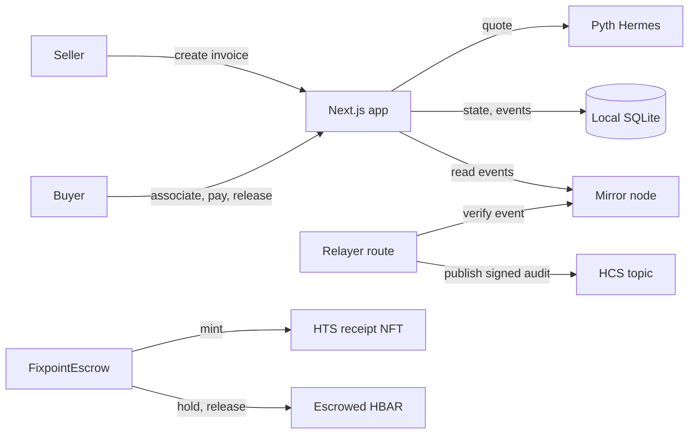

# Fixpoint

USD priced escrow, three Hedera services composed, Pyth oracle, tested, documented, one command.

Fixpoint is a small, opinionated escrow that prices work in dollars and settles in HBAR. A seller files an invoice for a USD amount. A buyer pays it at the live HBAR/USD rate from the Pyth oracle. The escrow contract holds the HBAR, mints an HTS NFT receipt to the buyer, and writes every state change to an HCS audit topic. The dollar amount never moves. Only HBAR does, and only at the rate the oracle published. This preview runs the same maths, the same state machine, and the same audit pattern as the deployed template, but on a local database so it is reproducible without a live network.

This repository is the running preview of the Fixpoint template's frontend and relayer logic. The real template is produced by:

```
npm create scaffold-hbar@latest -- --template <owner>/fixpoint
```

That scaffold ships the Solidity contract, the deploy script, the relayer service and this Next.js app. Here you get the app and the relayer route, with the on chain parts simulated honestly and labelled as such.

## Run it in 5 minutes

You need Node 20 or newer, or Bun. The preview is a Next.js 16 app.

1. Install dependencies.

   ```
   bun install
   ```

2. Create the local database. The schema is in `prisma/schema.prisma`. The default `DATABASE_URL` points at a SQLite file.

   ```
   bun run db:push
   ```

3. Seed the demo ledger. The seed is idempotent. It creates four invoices that together exercise every state and every audit message.

   ```
   bun run scripts/seed.ts
   ```

4. Start the dev server.

   ```
   bun run dev
   ```

The app listens on port 3000. Open the **Preview Panel** in your workspace to use it. Do not open `http://localhost:3000` directly; the preview is the supported entry point.

### Environment variables

Copy `.env.example` to `.env` and fill in what you have. The build and the lint pass with every value empty. Secrets are read lazily at runtime only.

| Name | Required | Where used | Example |
| --- | --- | --- | --- |
| `DATABASE_URL` | Yes | `prisma/schema.prisma`, `src/lib/db.ts` | `file:/home/z/my-project/db/custom.db` |
| `PYTH_HERMES_KEY` | No | `src/lib/pyth.ts` (sent as `x-api-key` to Hermes) | `pyth-…` |
| `HEDERA_OPERATOR_ID` | No | relayer route, signing HCS (real template only) | `0.0.1234` |
| `HEDERA_OPERATOR_KEY` | No | relayer route, signing HCS (real template only) | `0x…` (ECDSA) or `302…` (Ed25519) |
| `HCS_TOPIC_ID` | No | overrides the committed topic in `src/lib/hedera.ts` | `0.0.5847294` |
| `RECEIPT_TOKEN_ID` | No | overrides the committed token in `src/lib/hedera.ts` | `0.0.5847293` |
| `MIRROR_NODE_URL` | No | overrides the committed mirror in `src/lib/hedera.ts` | `https://testnet.mirrornode.hedera.com/api/v1` |

The committed constants in `src/lib/hedera.ts` (contract `0xC2a7B4Ecf4E0f3C5c67a89B1c0dE2f3A4b5C6d7E`, receipt token `0.0.5847293`, topic `0.0.5847294`, chain id 296 testnet) are demo values used throughout the UI. They are not a real deployment and the docs treat them as such.

## Reproduce a transaction

The seed creates four invoices. They appear on the home page and on `/history`.

| Invoice | Memo | State |
| --- | --- | --- |
| #1001 | Design sprint deliverable, March | CREATED |
| #1002 | Brand audit report | PAID |
| #1003 | Smart contract review and advisory | RELEASED |
| #1004 | Workshop deposit, refunded after reschedule | REFUNDED |

To run a full flow yourself:

1. Open `/invoices/new` as the seller (use the role switcher in the header). Set an amount in dollars, a pay by date, and a review window. Submit. The invoice is created with the `Created` event.
2. Switch to the buyer role. Open `/invoices/[id]`. If you have not associated the receipt token, the actions panel will tell you. Press **Associate**. This calls `POST /api/association`, which flips the `buyer_associated` flag in the key value store and returns a transaction hash.
3. Press **Pay**. The app fetches a fresh quote from `/api/quote`, which calls `getLatestPrice()` and `computeQuote()` in `src/lib/pyth.ts`. The pay route checks association, calls the pricing maths, simulates the HTS NFT mint, and records the `Paid` event. Any overpayment is computed as a refund and stored on the invoice.
4. Switch back to the seller. Press **Release**. The invoice moves to RELEASED and the `Released` event is written. (You can also press **Claim after review** once the review window has passed, or **Refund** to return the funds to the buyer.)
5. Open `/history`. The mirror node tab shows every chain event. The HCS tab shows every audit message. Rows where the chain event and the audit message agree are marked with a check and the audit sequence number.

You can publish a missing audit message from the history view by pressing the **Audit** button on a row. The route is idempotent, so pressing it twice does nothing the second time.

## Architecture



The deployed template has no database. The chain is the source of truth. The relayer route reads the chain event from the mirror node, then publishes a signed, compact, versioned audit message to the HCS topic. The app reads state from the contract and from the mirror node, and uses HCS for the tamper evident history.

HCS cannot be written from a smart contract. That is why the relayer exists. The relayer only audits. It never holds funds. It verifies the chain event first, then publishes. The chain remains the source of truth and HCS is the audit trail.

This preview persists the same facts in a local SQLite database so the demo is reproducible without a live network. The schema in `prisma/schema.prisma` is a faithful local simulation of the on chain state. The history view in the preview is built from the database. In the real template it is built from the mirror node.

## How the Pyth integration works

The pricing maths is the load bearing part of the contract. It lives in `src/lib/pyth.ts` and is invoked from `src/lib/invoices.ts` at pay time and from `GET /api/quote` for a live preview.

The conversion mirrors `FixpointEscrow.sol` exactly:

```
hbarWei = ceil( usdCents * 10^18 / (100 * price * 10^expo) )
```

The exponent is the Pyth feed exponent. For HBAR/USD it is `-8`. The numerator and denominator are scaled to keep the division integer. The result is rounded **up** in favour of the seller. The seller never receives less than the dollar amount at the published rate; the buyer may pay a rounding dust more.

Two safety bounds reject bad prices before the maths runs:

- **Staleness.** A price older than `MAX_STALENESS_SEC` (60 seconds) is rejected with `PRICE_REJECTED`.
- **Confidence.** A confidence wider than `MAX_CONF_BPS` (100 basis points) is rejected with `PRICE_REJECTED`. The confidence in basis points is `conf * 10_000 / price`.

Both constants are exported from `src/lib/hedera.ts` and mirrored in the contract.

The buyer can send more than the quoted total. The overpayment is computed as `sent - quote.totalWei` and stored on the invoice as `refundWei`. The buyer is owed that refund. In the real template a pull style refund pattern is used. In this preview the refund is recorded and shown; it is not yet claimable through a separate route.

The Hermes VAA endpoint requires an API key. The metadata endpoint (`/v2/price_feeds`) is public. The VAA endpoint (`/v2/updates/price/latest`) returns 401 without an `x-api-key` header. Set `PYTH_HERMES_KEY` to enable the live rate. Without one, the app falls back to a labelled offline seed price (source `seed`). If Hermes has been reached once in the process, a cached snapshot (source `cached`) is used while the network is unreachable. The UI always shows the source. The seed price is never presented as a live Pyth price.

## Project structure

```
src/
  lib/
    hedera.ts         # chain config, deployed object ids, units, safety constants
    pyth.ts           # Hermes client, pricing maths, staleness and confidence bounds
    invoices.ts       # escrow state machine: create, pay, release, refund, audit
    format.ts         # USD, HBAR, tinybar, weibar formatting
    errors.ts         # typed EscrowError mirroring contract custom errors
    kv.ts             # tiny key value store (counters, association flag)
    db.ts             # Prisma client
    api.ts            # typed client used by React components
    store.ts          # Zustand actor (seller / buyer)
    utils.ts          # cn() and helpers
  app/
    layout.tsx        # providers, fonts, theme
    page.tsx          # home: hero, live price, the four step flow, honesty note
    globals.css       # design tokens, paper, hairline utilities
    invoices/
      new/page.tsx    # create form with a live quote breakdown
      [id]/page.tsx   # invoice detail: timeline, settlement, receipt, actions, audit
    history/page.tsx  # mirror node table + HCS tab with payloads and agreement markers
    api/
      price/route.ts
      quote/route.ts
      association/route.ts
      invoices/route.ts
      invoices/[id]/route.ts
      invoices/[id]/pay/route.ts
      invoices/[id]/release/route.ts
      invoices/[id]/claim/route.ts
      invoices/[id]/refund/route.ts
      invoices/[id]/claim-refund/route.ts
      invoices/[id]/expire/route.ts
      audit/route.ts
      history/route.ts
  components/         # header, footer, site-shell, price-card, state-timeline, etc.
scripts/
  seed.ts             # idempotent seed of the four demo invoices and audit messages
prisma/
  schema.prisma      # Invoice, InvoiceEvent, Receipt, AuditMessage, Kv
.env.example
```

## Testing and verification

There are no automated unit tests in this preview. The build and the lint are the only static checks. State this plainly when you extend it.

What we run:

```
bun run lint
```

Manual verification is done with an agent browser that walks the full flow. The check list:

- All routes return 200 with no console or runtime errors.
- Create an invoice as the seller, switch to the buyer, associate, pay with a small buffer, and release. The state moves CREATED → PAID → RELEASED.
- The new invoice page shows a live quote that updates as the price moves.
- The history view shows the chain events and the matching HCS audit messages, with agreement markers.
- Dark mode toggles. The layout is responsive at 390 by 844.

If you change the pricing maths or the state machine, walk this list again by hand.

## Extending it

**Swap the price feed.** Change `HBAR_QUERY` in `src/lib/pyth.ts` and the feed match in `resolveFeedId()` to point at a different Pyth feed. Keep the staleness and confidence bounds unless you have a reason to relax them, and document the reason in the pull request.

**Change escrow rules.** The state machine is in `src/lib/invoices.ts`. `payInvoice`, `releaseInvoice`, `claimAfterReview`, `refundInvoice`, `claimRefundIfExpired` and `expireInvoice` are the entry points. Each one writes an `InvoiceEvent`. Keep that property. History is rebuilt from the event log.

**Add HSS automatic release.** A Hedera Schedule Service job that releases funds automatically after the review window is a stretch goal. It is documented here, not implemented. Adding it means a new route, a new event kind, and a new contract entrypoint. Do not trigger an automatic release silently inside the existing `settle()` path.

## Known limits and troubleshooting

- **Association is required before pay.** If you skip the associate step the pay route returns `RECEIPT_NOT_ASSOCIATED`. Press **Associate** on the invoice page or call `POST /api/association`.
- **ED25519 accounts cannot sign EVM transactions.** The contract calls and the HTS mint go through the JSON RPC relay. Use an ECDSA account for the operator. ED25519 accounts work for HCS signing in the real template, but not for EVM calls.
- **Mirror node lag.** The preview has no real mirror node. The history view is built from the local database. In the real template, allow a few seconds for the mirror node to ingest a transaction before the relayer verifies it.
- **The Pyth API key requirement.** Without `PYTH_HERMES_KEY` the live VAA endpoint returns 401. The app falls back to a labelled offline seed. Get a key from https://www.pyth.network/ .
- **The offline seed fallback.** The seed price is approximate and is never presented as a live Pyth price. The UI labels the source as `seed`. Do not ship a product that depends on the seed.
- **On chain interactions are a faithful local simulation, not signed by a real testnet key.** The contract address, the receipt token id and the topic id in `src/lib/hedera.ts` are demo constants. No transaction in this preview reaches a real Hedera network. No HCS signature in this preview is a real Ed25519 signature. The relayer route simulates the signature with a sha256 digest so the audit shape and the idempotency can be exercised end to end.

## Licence and credits

MIT.

Built on Next.js 16, Prisma, Tailwind CSS 4, shadcn/ui, the Pyth Hermes API and Hedera's EVM, HTS and HCS services. The design follows the brief: dollar priced escrow, three Hedera services composed, Pyth oracle, an HTS NFT receipt, an HCS audit trail, and a relayer that only ever audits.
